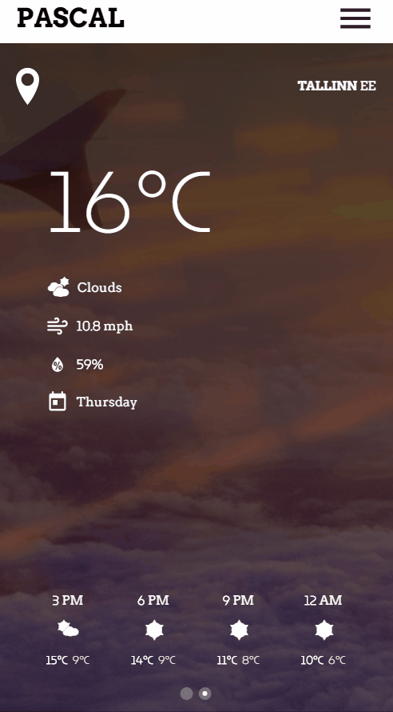
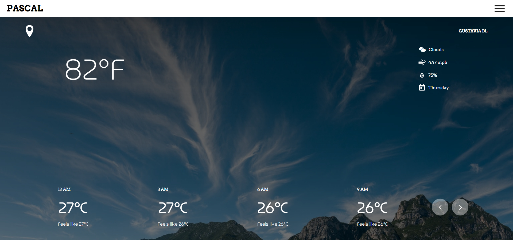
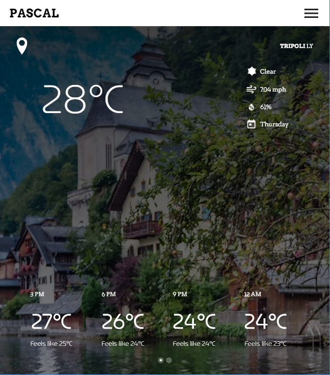
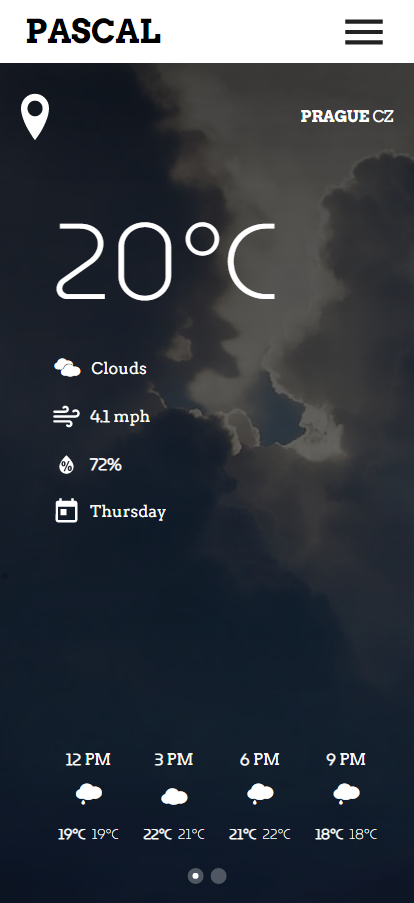

# Pascal

An interactive weather app made with SvelteJs and TailwindCSS using [Open Weather API](https://openweathermap.org/) for the [FreeCodeCamp Challenge](https://www.freecodecamp.org/learn/coding-interview-prep/take-home-projects/show-the-local-weather)

### Desktop:

### Tablet:

### Mobile:

## Features:

-   User can click on temperature to change from celsius to fahrenheit back and forth.
-   User gets displayed weather for the whole 12 hour.
-   User can search for countries and select cities to get it's weather and in case a city is not provided it's capital will be displayed.
-   In case the application failed to get the user's location it gets a random one, same if the api doesn't support the city you chose.
